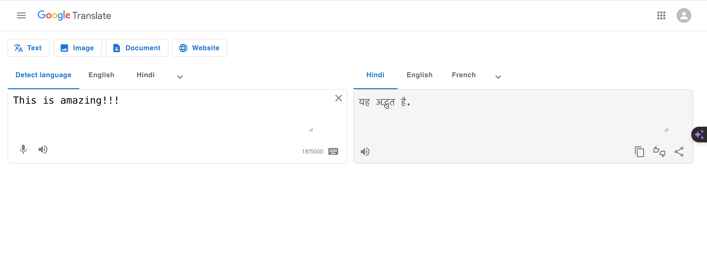
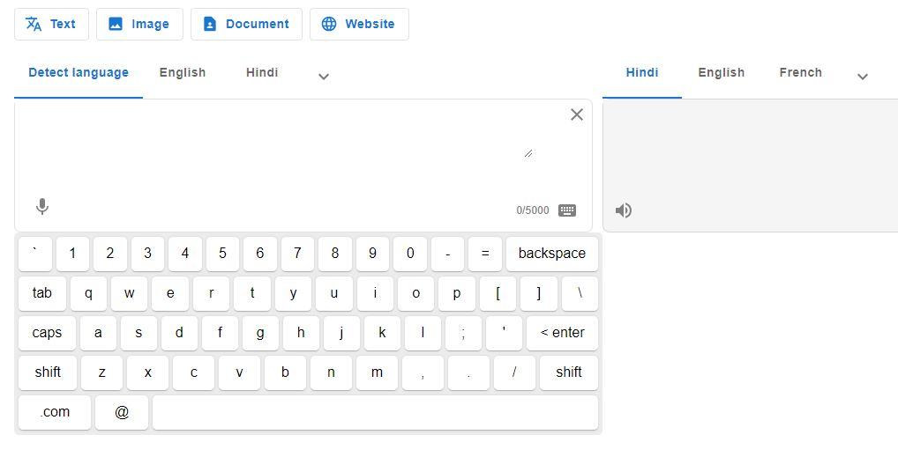

# React Google Translator Clone with Virtual Keyboard

**[Live Demo](https://google-translate-clone-beige.vercel.app/)**

## Project Snapshot

A simple Google Translator clone built using React and Material UI. This application allows you to translate text from one language to another using the MyMemory API. It also includes debouncing to optimize the translation process and a virtual keyboard for ease of input.

## Features

- Translation using the [MyMemory API](https://api.mymemory.translated.net/get?q=Hello%20World!&langpair=en|it).
- Debouncing to improve performance and reduce unnecessary API requests.
- Virtual keyboard integration for easy text input.

## Project Keyboard Feature

